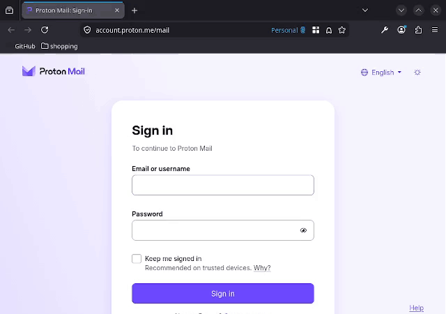
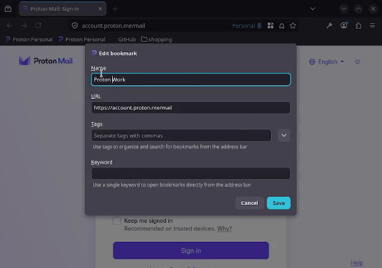
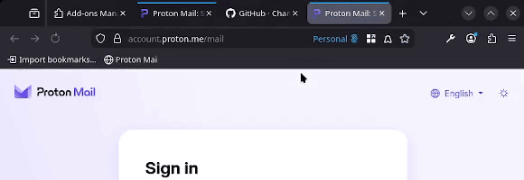
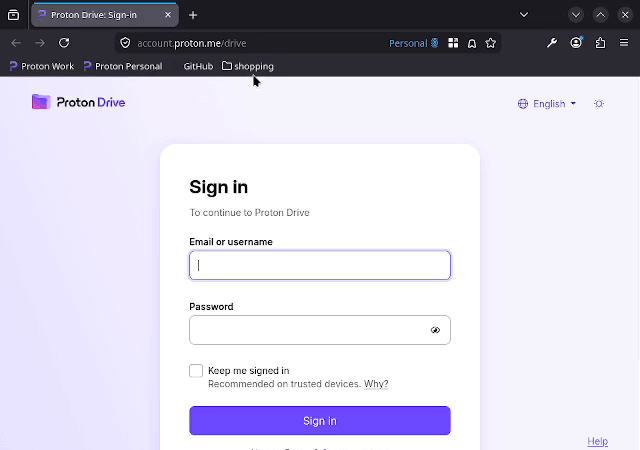
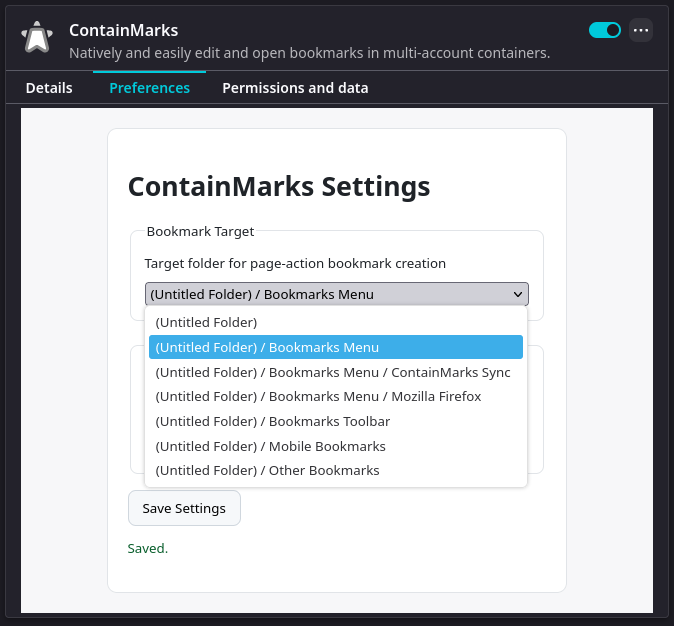

# ContainMarks

Natively and easily edit and open bookmarks in multi-account containers.

<p align="left">
  <a href="https://addons.mozilla.org/en-US/firefox/addon/containmarks/">
    
    
  </a>
</p>

---

## Compatability

This extension works well with both [*Temporary Containers* on the Mozilla-Addons-Store](https://addons.mozilla.org/en-US/firefox/addon/temporary-containers/) and [*Temporary Containers Plus* on the Mozilla-Addons-Store](https://addons.mozilla.org/en-US/firefox/addon/temporary-containers-plus/).

## Usage

<details>
<summary>Quickly bookmark the current page + container combo</summary>



</details>

<details>
<summary>Assign a container from the bookmark context menu</summary>



</details>

<details>
<summary>Easily edit assigned bookmarks with the native bookmark UI</summary>



</details>

<details>
<summary>Assign whole folders in one pass</summary>



</details>

<details>
<summary>Choose where quick bookmarks are saved from the options page</summary>



</details>

---

## Security

ContainMarks attaches a one-time code (a token) to all assigned bookmarks. This ensures only bookmarked pairings open in the assigned container.  
If you experience any issues with stale tokens, the extension preferences page ([read more below](#token-retention-options)) may be able to help.

## Sync

ContainMarks now works with Firefox Sync / bookmark transfer methods.

## Privacy Policy/T.O.S/C.O.C

1. We do not collect ANY information from you, everything is stored locally.  
2. There are no terms of service, use as you please. Do respect the
[License](./LICENSE) file, however.
3. Be kind to others. This rule will be enforced by owner of this repository, at their discretion.

---

# Contribution

Test your code well before submitting it.

## Development Build

Using the Nix development shell (recommended in this repo), generate a Firefox extension package:

```bash
nix develop -c npm install
nix develop -c npm run build:firefox
```

Or without Nix (if `node` and `npm` are already installed):

```bash
npm install
npm run build:firefox
```

This writes `dist/*.zip` (the standard WebExtension build artifact). For a local unsigned `.xpi` file:

```bash
nix develop -c npm run build:firefox:xpi
```

---

# Slightly more technical details

## Security Tokens

When a bookmark is assigned to a container, it receives a random token and a stable container index. The assignment is embedded in the URL's fragment, so the real URL remains intact and navigable.  
E.G. `https://example.com` -> `https://example.com#cm:r4nD0Mt_k3n:4`

If the original URL already had a fragment (e.g. `https://example.com#section`), it is preserved after the encoding:  
`https://example.com#cm:r4nD0Mt_k3n:4#section`

The number is the stable, first-seen container mapping index.

**This token is hidden when the user goes to edit the bookmark**. It is hotswapped back in when the bookmark is saved. This makes native bookmark editing possible without exposing the internal workings of the extension or requiring users to not mess with the token in the URL. This is a slight oversimplification, but this is ~90% correct. Read the code for the full details.

## Sync Mapping Folder

ContainMarks stores container mapping bookmarks in the Bookmarks Menu under `ContainMarks Sync`.

- Folder location: `Bookmarks Menu` (`menu________`)
- Mapping bookmark title: `Mapping: {containerName}`
- Mapping bookmark URL: `about:{firstSeenIndex}:{cookieStoreId}:{backupName}`

This keeps container references stable across renames and helps sync behavior across devices.

## Token Retention Options

Token retention behavior is configurable in the options page:

- `Regenerate tokens on startup` toggle
- `Regenerate tokens on every use` toggle

## Page-Action Bookmarking

The page-action shortcut always creates a bookmark for the current tab URL.

- If the tab is in a container, the bookmark is container-mapped.
- If the tab is not in a container, a plain bookmark is created.

## Runtime Architecture

- `src/backgroundApp.ts`: event orchestration (startup, tab update handling, context menus, page-action flow)
- `src/containerMappingStore.ts`: stable index mapping + bookmark-backed sync persistence
- `src/containerMappings.ts`: URL codec for bookmark and mapping formats
- `src/settings.ts`: settings sanitization, validation, and storage boundaries

This separation keeps encoded URL rules and sync mapping persistence independent from browser event wiring.

---

## Made with ideas from

- [*Container Bookmarks* on the Mozilla-Addons-Store](https://addons.mozilla.org/en-US/firefox/addon/container_bookmarks/)
- [*Open URL In Container* on the Mozilla-Addons-Store](https://addons.mozilla.org/firefox/addon/open-url-in-container/)

# License

All code is licensed under the MIT License.  
Because innovation is desirable.
