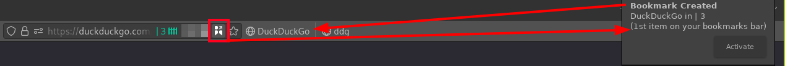
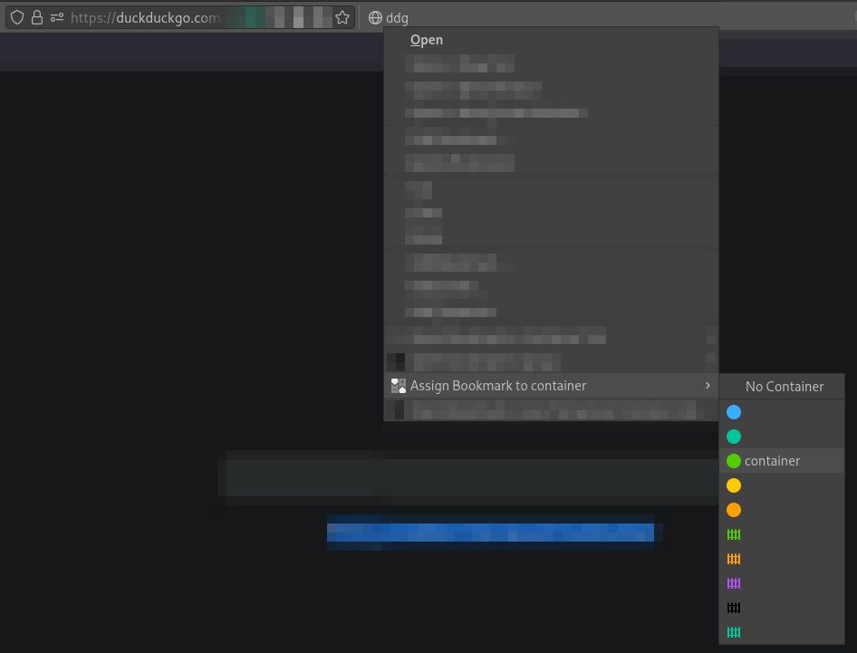

# ContainerMarks

Firefox extension that allows you to **securely** open bookmarks in
multi-account containers.

Get it [here!](https://addons.mozilla.org/en-US/firefox/addon/containmarks/)

---

## Usage

Access from the omnibar:  

Access from the bookmark-bar context-menu:  

Applying this operation to the contents of entire folders is also supported.

---

## Security Tokens

When a bookmark is assigned to a container, it's assigned a random token.  
It's prepended to the existing URL, as well as the prefix `about`.  
E.G. `https://example.com` -> `about:r4nD0Mt_k3n:https://example.com`

## Token retention Policy

Tokens are refreshed upon these conditions

- When the browser restarts

- When the bookmark's used

- When a security breach is attempted  
  - If a valid token is used, but the URLs don't align... The user is alerted.
  In addition to URL refreshment.

Unused or invalid tokens are deleted upon these conditions

- When the browser restarts

- After the token in question has been refreshed

- After bookmark deletion

- After a bookmark is unassigned

## Privacy Policy/T.O.S/C.O.C

1. We do not collect ANY information from you, everything is stored locally.  
2. There are no terms of service, use as you please. Do respect the
[License](./LICENSE) file, however.
3. Don't be a dick. It's that simple.

## Made with components from

- [*Container Bookmarks* on the Mozilla-Addons-Store](https://addons.mozilla.org/en-US/firefox/addon/container_bookmarks/)
- [*Open URL In Container* on the Mozilla-Addons-Store](https://addons.mozilla.org/firefox/addon/open-url-in-container/)

## License

All code is licensed under the MIT License.  
Because innovation is desirable.

## Contributing

Do it. If it's needed, contribute. I'll accept any Pull/Merge request, so long
as it's reasonable, and decently tested.
